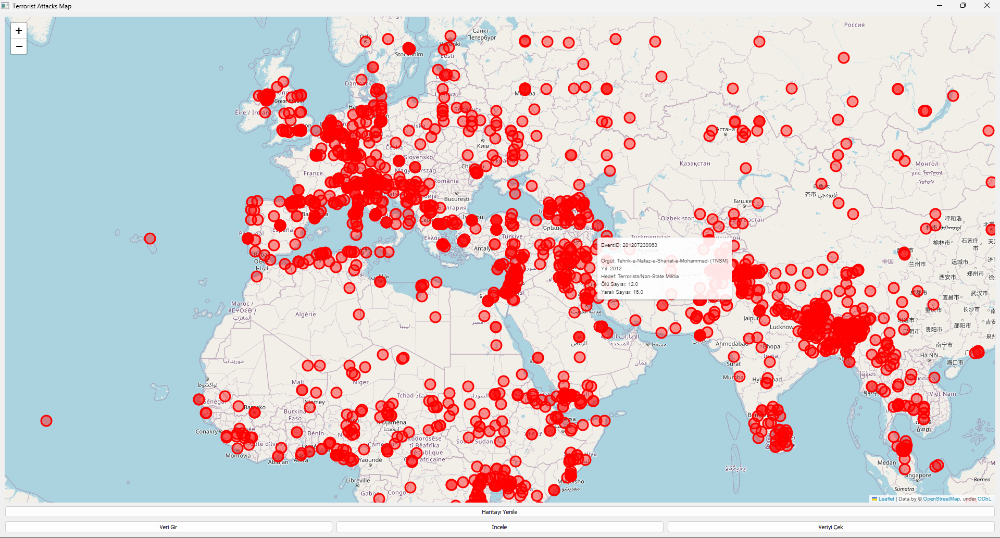
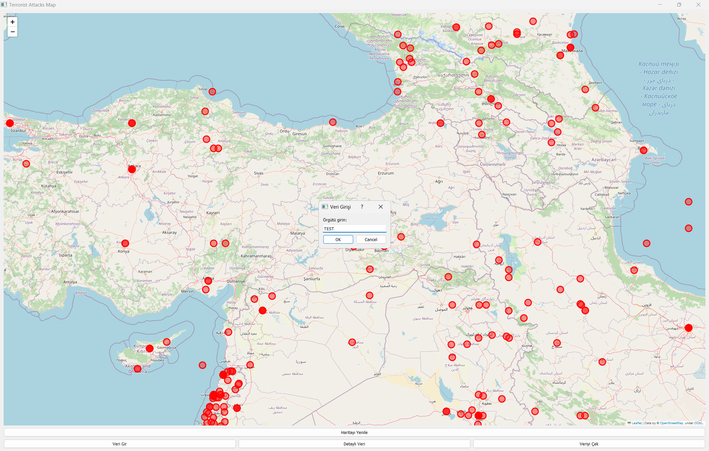
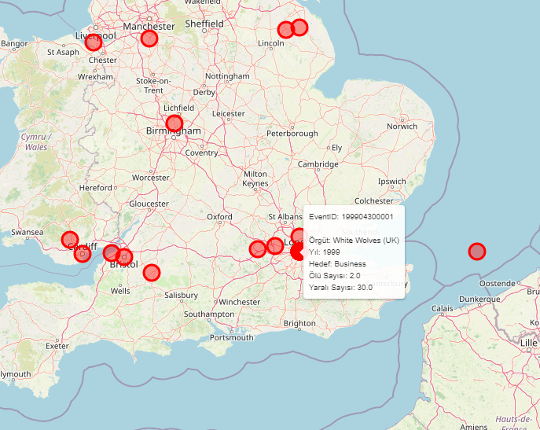
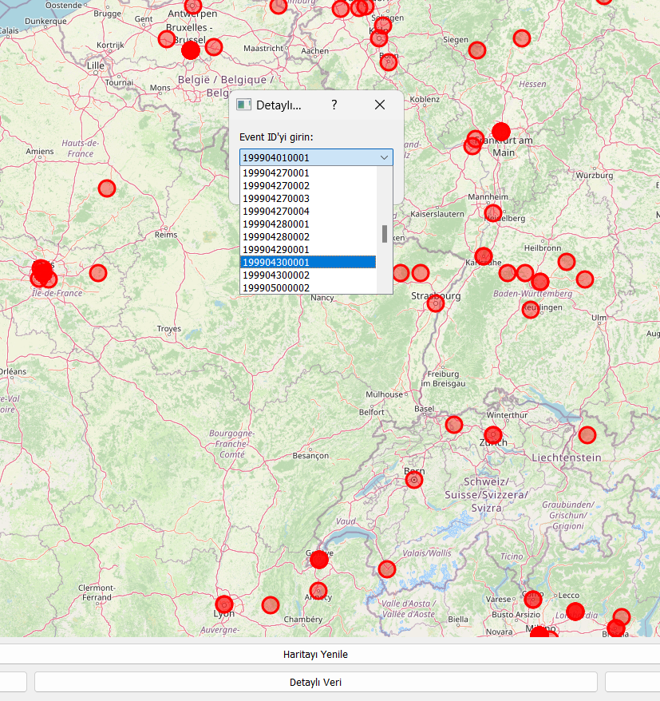
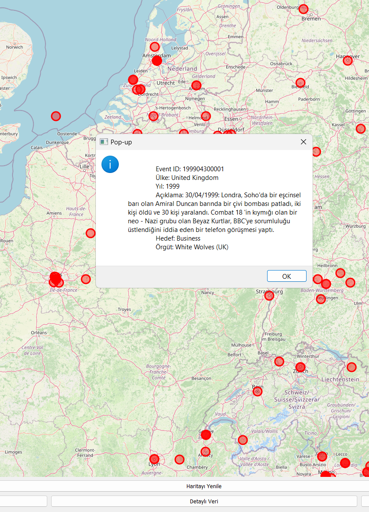
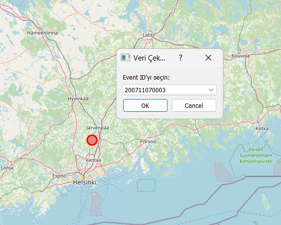
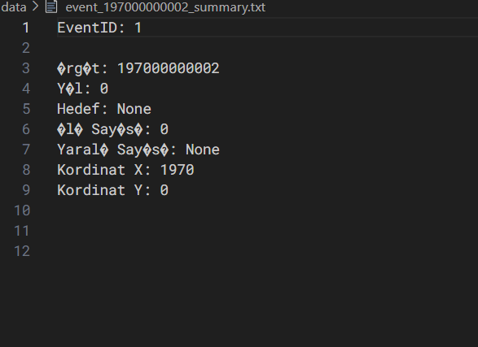
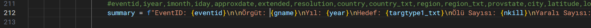
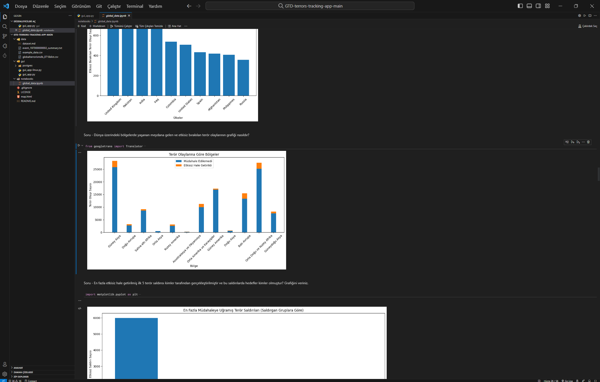

# GTD-terrors-mapping

- Bu proje tamamen eğitim amaçlıdır ve yaşanan terör olaylarıyla ilgili bir bağıntı bulunmamaktadır. Bu projede kullanılan veriler bir suç teşkil etmemesi adına 2013 yılına kadar sınırlandırılmıştır. Orjinal verilere internet üzerinden rahatlıkla erişilebilmektedir. Burada yazan kullanım yönlendirmelerini lütfen dikkatlice okuyunuz ve hepsini okuyup yapılması gerekenleri yaptıktan sonra programı hatasız bir şekilde başlatabilirsiniz.
  

### Programın Kullanımı
---
- Program arayüzümüzde toplamda 4 adet butonumuz bulunmaktadır. Programımız açıldığı zaman karşımıza beyaz boş bir ekran gelecektir; yapmamız gereken şey 'Haritayı Yenile' butonumuza basmak ve beklemektir (kullanacağımız verinin büyüklüğüne bağlı olarak bu işlem uzun sürebilmektedir). Ardından bizleri 3 tane daha buton karşılamaktadır. Bunlar sırasıyla ve özellikleriyle aşağıda belirtilmiştir.  
- - 1- Veri Gir:  
    - Burada takibi yapmak istediğimiz yeni bir veriyi girmemize olanak sağlanmaktadır. Butona tıklandıktan sonra karşımıza gelen doldurulması gereken boşluklar gui/gui_app.py içerisinde bulunan button1_clicked() fonksiyonu içerisindeki 'new_row' değişkenin kontrol edilebilmekte ve değiştirilebilmektedir.
      
  
- - 2- Detaylı Veri  
    - Burada 'eventid' değerini girdiğimiz verinin (bu işlemin süresi veri büyüklüğüne bağlı olarak uzayabilmektedir) çeviri işlemlerinin yapılması ardından bizlere button2_clicked() fonksiyonunda belirtmiş olduğumuz başlıklar karşılığında bir pop-up şeklinde gelecektir. (bahsetmiş olduğumuz başlıklar ve değerler button2_clicked() fonksiyonu içerisinden değiştirilebilmektedir.)
         
 
 
  
- - 3- Veriyi Çek  
    - Burada butona basmamızın ardından karşımıza bir 'eventid' listesi gelecektir. Bu listeden verisini çekmek istediğimiz verinin 'eventid' bilgisi girilerek veriyi data klasörümüz altına 'eventid' numarası ile kaydetmektedir. Bu butonun amacı ilgili başka bir uygulamanız, projeniz var ise ya da yalnızca bir verinin çıktısını almak ve ayırmak istiyorsanız; bu amaçlarınıza yardımcı olacaktır.
      
 
- - Buradaki 'eventid' değerleri örnek olması için konmuştur bu yüzden farklıdır.
 
 
  

## Nedir? Ne İşe Yarar?
##### /images klasöründe bulunanlar:
- Burada README.md üzerinde kullanılan resimler bulunmaktadır.

##### /data klasöründe bulunanlar:
- example_data.csv --> bu klasörde bulunanlar gerçek verinin bir örneğini teşkil etmektedir. Gerçek veriye dataset.md dosyasının ne altında verilen link üzerinden erişebilirsiniz. Gerçek veriyi indirdikten sonra bu veriyi bu klasöre taşıyarak dosya yollarını değiştirdikten sonra kullanabilirsiniz (Değiştirilmesi Gereken Dosya Yolları başlığında detaylar söylenmiştir).
- event_197000000002_summary.txt --> Bu, veriyi çek butonunda girilen terör olayına ait veri çıktısıdır. Çıktıdaki başlıklar eklenebilir ve çıkarılabilir başlıklardır. Bu başlıkları gui/gui_app.py içerisinde bulunan button3_clicked() fonksiyonunda bulabilirsiniz.
- dataset.md --> Burada hangi sütunun ne anlama geldiğiyle ilgili detaylı bilgilendirilme yapılmıştır.

##### /gui klasöründe bulunanlar:
- gui_app.py --> Programımızı bu python belgesini çalıştırarak başlatmaktayız. Bu kod programımızın genel hatlarını oluşturmaktadır.
##### /gui/postgres/ klasöründe bulunanlar:
- postgres_info.py --> Veritabanı bağlantıları için önce bir postgresql veritabanı oluşturmalı ve verilerinizi aktarmalısınız. Ardından burada veritabanınza ait girmeniz gereken bilgileri doldurmalısınız.
- postgrestocsv.py --> Bu kodu çalıştırmak veritabanınızdaki verileri bir çıktı olarak almanızı sağlamaktadır.
- csvtopostgres.py --> Bu kodu çalıştırmak ise yukarıda bahsettiğimiz işlemin tam tersini, yani csv halindeki verimizi postgresql veritabanımıza atmamıza yardımcı olacaktır.
##### /notebooks klasöründe bulunanlar:
- global_data.ipynb --> Burada ise çeşitli veri analizlerimiz ve grafiklerimiz bulunmaktadır. Bu grafiklerden ve analizlerden bazıları haritalandırma sistemi şeklinde gerçekleştirilmiştir. Dolayısıyla bu kodu bir jupyternotebook arayüzü ile veya bir ide ile açmanız önem arz etmektedir.
  

  

## Dikkat Edilmesi ve Yapılması Gerekenler :
- data klasörü içerisinde bulunan dataset.md, kullanmakta olduğumuz GTD verisindeki sütunların isimlerini ve anlamlarını açıklamaktadır.
- data klasörü içerisinde bulunan "event..." ile başlayan veri, uygulama içerisindeki çekilen veriyi göstermektedir.
- 'example_data.csv' verisi örnek bir veri teşkil etmektedir, bir gerçekliği olmamaktadır. 

- 'gui_app.py' içerisinde bulunan 'csv_path' değişkenlerine gerekli dosya yollarını doğru bir şekilde girdiğinizden emin olunuz.
- Bu proje içerisinde bulunan Folium kütüphanesi Ubuntu üzerinde xorg ile uyumsuz çalışmaktadır. (Windows üzerinde başarılı bir şekilde çalıştırabilirsiniz.)
- 'gui' klasöründe içerisinde bulunan postgres klasöründeki 'csvtopostgres.py', '.csv' halinde bulunan veriyi postgresql veritabanına aktarmanıza olanak sağlar. Ayrıca içerisinde bulunan df değişkenine verilen dosya yolu doğu bir şekilde girilmelidir.  
- Aynı klasör içerisinde yer alan 'postgrestocsv.py' ise postgresql veritabanına aktarmış olduğumuz veriyi '.csv' dosya türüne çekmemizi sağlar. Burada da 'output_file' değişkenine verilen dosya yoluna dikkat edilmelidir.
- Veritabanı ile uygulama arasındaki bağlantısının başarılı olması için postgres_info.py dosyasında bulunan değişkenlere gerekli bilgiler girilmelidir.

- notebooks klasörü içerisinde ise verilerle ilgili analizler yapılmıştır ve tamamen eğitim amaçlıdır.
  

## Değiştirilmesi Gereken Dosya Yolları
- Dosya Yollarında Belirtilen Veri example_data.csv için kullanılmaktadır. Dilerseniz orjinal veriyi indirip, data klasörüne yükleyip dosya yolu vererek kullanabilirsiniz.

- gui/gui_app.py
csv_path = "D:\\flas\\GTD-terrors-tracking-app-main\\GTD-terrors-tracking-app-main\\data\\example_data.csv" # kendi pathinizi girerken örnek olması için bendeki konumunu yazdım. Eğer bu şekilde belirtmenize rağmen hata alıyorsanız USB bellek üzerinde çalıştırabilirsiniz.
csv_path = "D:\\flas\\GTD-terrors-tracking-app-main\\GTD-terrors-tracking-app-main\\data\\globalterrorismdb_0718dist.csv"
data_terrors = pd.read_csv(csv_path, encoding='ISO-8859-1', low_memory=False)
map_creator() fonksiyonunun sonunda bulunan -->   map_file_path = '\\map.html' --> '\\' bundan öncesini kendi pathinize göre düzenleyin.
button1_clicked() fonksiyonunun sonunda bulunan -->   terrors = pd.read_csv('\\data\\example_data.csv') ve terrors.to_csv('\\data\\example_data.csv', index=False) 

- gui/postgres/postgrestocsv.py
output_file = "data\\terrors_export.csv" # data klasöründen öncesini kendi dosya yolunuza göre belirleyiniz.

- gui/postgres/csvtopostgres.py
df = pd.read_csv('data\\example_data.csv') # kendi dosya yolunuza göre düzenleyiniz.

  
## Kullanmış olduğum kütüphaneler:

- findspark
- pyspark
- pandas
- folium
- matplotlib
- pydeck
- translate
- sys
- PyQt5
- psycopg2
- postgres
- googletrans
- geopy
